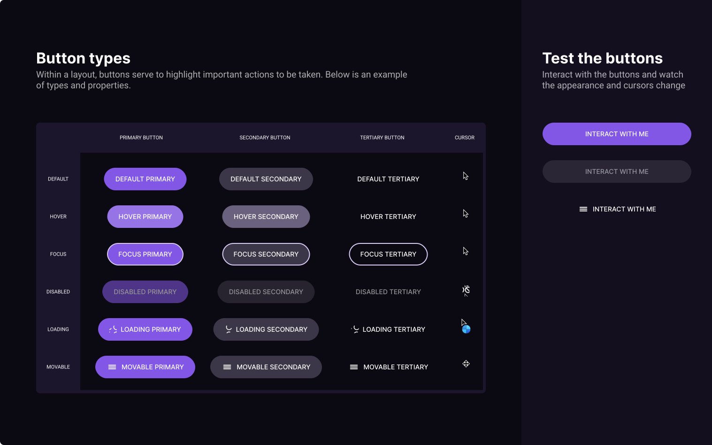

<h1 align="center"> BUTTON TYPES </h1>

IN PRODUCTION

HTML buttons documentation

<a href="#">
  Click here or on the image above to access the project page
</a>

## Technologies

Project developed with the following technologies:

- React Js
- Typescript
- Git e Github

## Project

Weekly challenge [#boracodar](https://boracodar.dev/) proposed by [rocketseat](https://www.rocketseat.com.br/)

#03 - Documentation of HTML buttons

Preview of button types, their states and the appropriate cursors

## Layout

You can view the project layout through [THIS LINK](https://www.figma.com/community/file/1197534710257750520). You must have a [FIGMA](https://www.figma.com/) account to access it.

---

Created by [Jairo Sousa](https://github.com/jairo-sousa)
